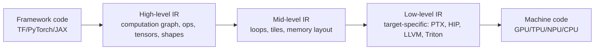
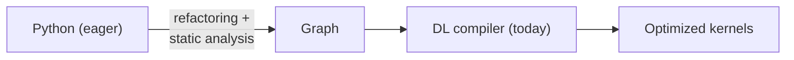
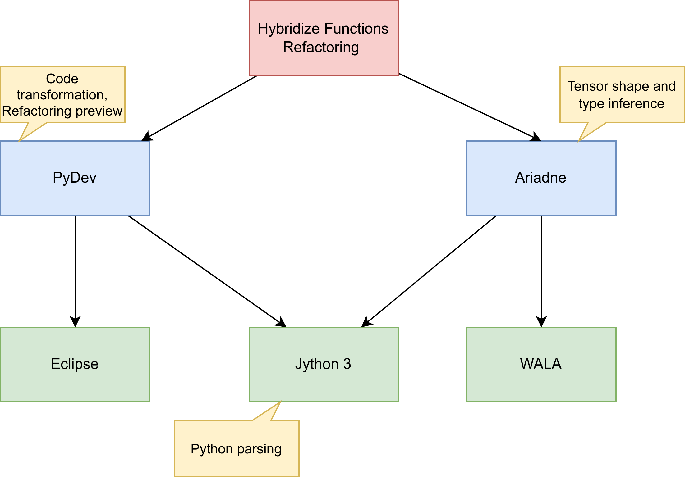
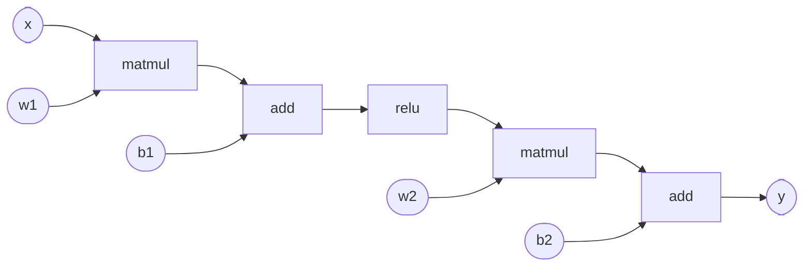
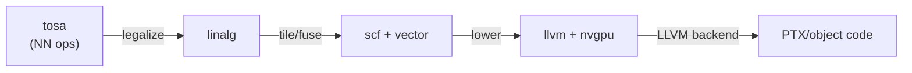
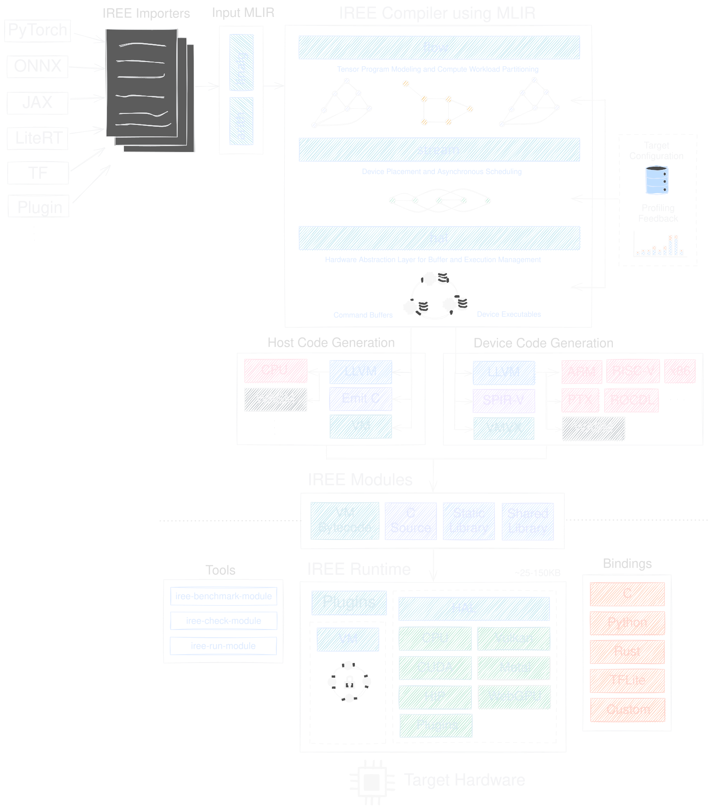
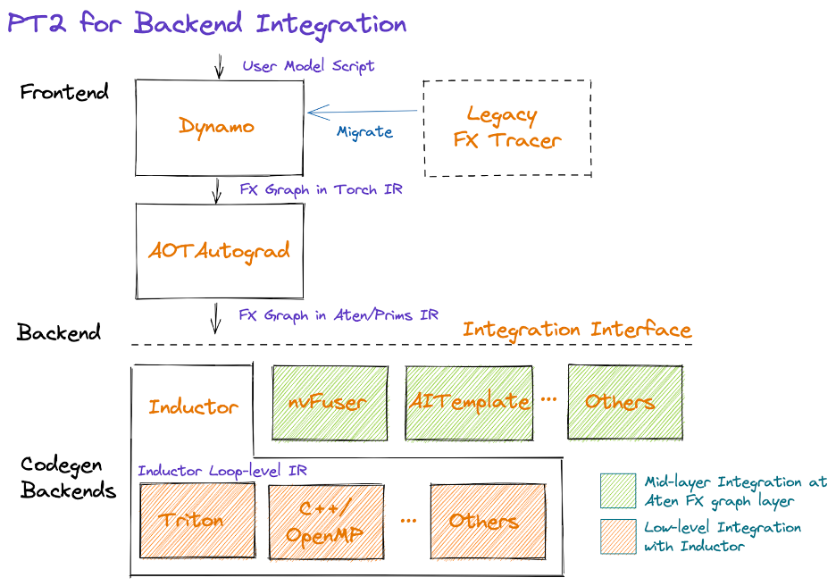

# Deep Learning Compilers

## Where We Are in the Course

So far we have covered the *classical* compiler pipeline:

1. Introduction.
1. Lexical analysis (JFlex).
1. Syntax analysis (CUP).
1. Type checking (attribute grammars, type constraints).
1. Intermediate code (ASTs, DAGs, three-address code).
1. Control-flow analysis.
1. Data-flow analysis.
1. Compiler optimizations.

Today: an *advanced* topic that puts all of this to use in a new domain---**deep learning**.

> Q: What does a "compiler" mean when the program is a *neural network*?

## Two Lectures, One Class

This is a two-hour session, covering two related advanced topics.

### Part 1 (This Deck)---Deep Learning Compilers

- Why DL needs its own compilers.
- Imperative vs. graph execution.
- Computation graphs as IR.
- Operator fusion, layout transforms, autotuning.
- A tour of TVM, XLA, **MLIR**, TorchInductor, IREE.

### Part 2 (Next Deck)---LLMs in Compiler Construction

- LLMs *as* compiler components.
- Meta's LLM Compiler, neural decompilation, fuzzing.

## Why a New Kind of Compiler?

Modern DL workloads stress every assumption a classical compiler makes.

- The *units of computation* are tensor operations, not scalar instructions.
- The hot loops are massively parallel and run on GPUs, **TPUs** (Google's Tensor Processing Units), and **NPUs** (Neural Processing Units, e.g., on phones), not CPUs.
- Performance gaps between naive and optimized code can be **10--100x**.
- The "source language" is increasingly Python, dynamically typed and side-effectful.

> Q: Could you take a TensorFlow model, lower it to LLVM IR, and call it a day?

## The Combinatorial Explosion

:::::::::::::: {.columns}
::: {.column width="50%"}

### Frameworks (the "Language" Side)

- TensorFlow.
- PyTorch.
- JAX.
- ONNX (interchange format).
- Keras, MXNet, PaddlePaddle, ...

:::
::: {.column width="50%"}

### Hardware (the "Target" Side)

- NVIDIA GPUs (CUDA).
- AMD GPUs (ROCm/HIP).
- Google TPUs.
- Apple Silicon (Metal/ANE).
- Mobile NPUs (Qualcomm, MediaTek).
- Custom accelerators (Cerebras, Graphcore, Groq).

:::
::::::::::::::

> Q: $M$ frameworks $\times$ $N$ targets means $M \cdot N$ hand-tuned backends. How do compilers usually break this?

## The DL Compiler Stack: A Picture



Low-level IR targets: **PTX** (NVIDIA's GPU assembly-level IR), **HIP** (AMD's CUDA-compatible runtime + IR), **LLVM** (the classical CPU/GPU backend), **Triton** (a Python-embedded GPU kernel DSL---details later).

> **Same lowering principle as a classical compiler.** What's new is the *high level*.

## Imperative vs. Graph Execution

:::::::::::::: {.columns}
::: {.column width="50%"}

### Imperative (Eager)

```python
import torch

def f(x):
    y = torch.relu(x @ w1 + b1)
    z = y @ w2 + b2
    return z
```

- Runs op-by-op, like normal Python.
- Easy to debug (set a breakpoint!).
- Dynamic: control flow can depend on runtime tensor values.
- Slow: no cross-op optimization.

:::
::: {.column width="50%"}

### Graph (Deferred)

```python
@torch.compile        # or @tf.function
def f(x):
    y = torch.relu(x @ w1 + b1)
    z = y @ w2 + b2
    return z
```

- Captures a graph of ops first, executes later.
- Compilable: fuse, optimize, schedule.
- Deployable: serialize and run without Python.
- Restrictive: side effects and dynamic Python don't fit.

:::
::::::::::::::

## Why This Matters---and a Research Connection

Hybrid frameworks (TF, PyTorch 2.x) let developers *opt in* to graph execution per function: `@tf.function`, `@torch.jit.script`, `@torch.compile`.

But it is not *free* to use:

- Side effects (printing, mutating Python lists, file I/O) silently break.
- Python control flow may need rewrites.
- Errors are reported at compile time, often far from the cause.

> This is exactly the boundary our research investigates---*when is it safe and beneficial to refactor an imperative DL program to graph execution?* [@kh23; @kh25]

## Two Worlds, One Bridge

The *DL compiler* sits on the **graph** side of the bridge. Our research sits on the **imperative-to-graph** side.



- Static tensor analysis decides *which* eager functions can become graphs.
- A DL compiler then takes that graph and makes it fast.
- A 2.16x average speedup on real DL projects when refactoring is done correctly [@kh25].

> Q: Why can't we just compile *all* Python automatically?

## Inside the Bridge: A Static-Analysis Refactoring Tool

:::::::::::::: {.columns}
::: {.column width="55%"}

{width=100%}

:::
::: {.column width="45%"}

### What Each Analysis Does

Built on **WALA** (T.J. Watson Libraries for Analysis, IBM); **Ariadne** is WALA's Python/tensor frontend, providing the tensor and type analyses below.

- **Tensor analysis** (Ariadne): track which Python values flow as tensors (vs. lists, dicts, scalars).
- **Side-effect analysis**: identify operations that would not survive graph capture (mutating Python state, I/O, non-deterministic ops).
- **Preconditions**: a *safety contract* per function---if all checks pass, refactoring is sound.

:::
::::::::::::::

> This is **classical static analysis**, applied to a brand-new domain. Everything you learned about CFG and data-flow analysis maps directly---and the same ideas extend to SSA and pointer analysis, which we only previewed on the introductory overview slide.

## Speculation: Living With Python's Dynamism

Python is dynamically typed and reflective. Pure static analysis hits walls.

### The Speculative-Analysis Trick

- When the analysis cannot decide a question, ask *"is there reasonable evidence?"*
- E.g., function name, decorator, type hint, library import suggesting a tensor.
- Refactor on that *speculation*, but **document the assumption** for the developer.

> An *unsound* analysis with explicit assumptions can be more useful than a sound analysis that refuses to say anything.

This is a recurring theme in modern PL research: relax soundness, regain coverage, make the assumptions visible.

## The Tool in Action

{width=40%}

> Real Eclipse plug-in. Real refactoring preview. Real `@tf.function` decorator inserted automatically once the analysis confirms preconditions hold.

## Why TensorFlow and Not PyTorch?

A fair question: most of you write PyTorch. Why does this research target TensorFlow's `@tf.function`?

- **Maturity**: `@tf.function` shipped with TF 2.0 (2019). `torch.compile` became the default only in PyTorch 2.0 (2022) and is still evolving rapidly.
- **One canonical mechanism**: TF settled on `@tf.function`. PyTorch has accumulated `torch.jit.trace`, `torch.jit.script`, `torch.compile`/Dynamo, FX---each with different capture semantics.
- **Explicit decorator boundary**: `@tf.function` requires a *deliberate* annotation. That is the kind of stable abstraction a static analysis can latch onto.
- **Tooling lineage**: WALA Ariadne grew up around TensorFlow patterns. Re-targeting to PyTorch requires a parallel set of tensor-generator summaries---*active future work*.

> The approach generalizes. PyTorch and JAX are next---and the retracing, graph-break, and side-effect patterns we study in TensorFlow *recur* in both. They are general DL-compiler problems, not TF-specific quirks.

## Computation Graphs as the High-Level IR

:::::::::::::: {.columns}
::: {.column width="30%"}

A DL model is naturally a directed acyclic graph (DAG) of tensor ops.

- **Nodes**: operators (matmul, conv, relu, softmax, ...).
- **Edges**: tensors (with shape, dtype, device).
- **Roots**: inputs/parameters.
- **Leaves**: outputs/loss.

:::
::: {.column width="70%"}



Looks like a classical *expression DAG*---but the data flowing on edges is multi-dimensional.

:::
::::::::::::::

## Static Single Assignment, Tensor Edition

**SSA (Static Single Assignment)** is a classical compiler IR property where every value has a single defining op (we didn't cover SSA explicitly this semester, but it's a small idea):

- Most DL IRs are **SSA-like**: every tensor value has a single defining op.
- Functional, side-effect-free by construction.
- This is what makes graph-level optimization tractable.

> Tensors get rich type information: shape, rank, dtype, layout, device---much richer than scalar SSA.

## Shape and Type Information

A tensor's *type* in a DL IR is much more than `int` or `float`.

| Attribute | Example                     |
|-----------|-----------------------------|
| Rank      | 4 (NCHW image)              |
| Shape     | `[32, 3, 224, 224]`         |
| Dtype     | `float16`                   |
| Layout    | `NHWC` vs. `NCHW`           |
| Device    | `cuda:0`                    |
| Sparsity  | dense/CSR/block-sparse  |

**Layout codes**: N = batch, C = channels, H = height, W = width---so `NCHW` orders memory as batch-major then channels, `NHWC` as batch-major then spatial. Different hardware prefers different orderings; rewriting between them is a real DL-compiler pass.

> Q: How does this change what *type checking* and *type inference* mean?

## Static vs. Dynamic Shapes

- **Static shapes**: every dimension known at compile time. Easy to optimize.
- **Dynamic shapes**: batch size, sequence length, etc., vary at runtime. Common in NLP.
- **Symbolic shapes**: dimensions represented as variables (`s0`, `s1`); constraints tracked.

PyTorch 2.x uses *symbolic shape* tracking in its compiler so it can specialize without re-tracing every input [@pt2].

## Why DL Compilers Handle Gradients

DL training is *forward and backward*. A DL compiler has to deal with both.

- **Forward pass**: input → output (running the model).
- **Backward pass**: output → **gradients** --- partial derivatives of the loss (a scalar error measure) with respect to each model parameter (a learnable weight). Used by gradient descent to nudge parameters and reduce loss. Mechanized chain rule from calculus.
- **Automatic differentiation** is the technique that derives the backward graph from the forward graph mechanically.
- A DL compiler must capture, optimize, and lower **both graphs together**: fusing across the forward/backward boundary, sharing intermediate buffers, recomputing for memory.

In PyTorch 2 this is what **AOTAutograd** does (the second box in the pipeline diagram coming up): it captures the backward pass ahead-of-time so the compiler sees the whole training step.

> Inference-only compilers (TF Lite, TensorRT) skip backward and have a smaller job. Training compilers don't get to skip it.

## The Big Idea: Operator Fusion

The single most important DL-compiler optimization.

```
relu(x + b)          ----fuse---->     fused_add_relu(x, b)
   2 kernels                              1 kernel
   2 round trips through                  1 round trip
   GPU memory                             GPU memory
```

- Modern GPUs are **memory-bound**, not compute-bound, for many ops.
- Fusing eliminates round-trips through global memory.
- Routine 2--5x speedups; sometimes more.

> Q: Why does this matter much more for GPUs than for CPUs?

## A Family of Fusion Patterns

- **Element-wise fusion**: `add`, `mul`, `relu`, `sigmoid`, ...---chain freely.
- **Reduction fusion**: fold reductions (`sum`, `mean`) into a producing kernel.
- **Vertical fusion**: stack producers and consumers.
- **Horizontal fusion**: combine independent ops sharing inputs.
- **Conv + BatchNorm + ReLU**: the classic CNN fusion.

This is the DL-compiler analogue of *local algebraic simplification* (the DAG-based CSE / algebraic-identity transforms from the local-optimizations part of the lecture) + *loop fusion* (Part 4 of the optimizations lecture, applied to scalar loops; here it operates on tensor ops).

## Other Classical Optimizations, in DL Garb

| Classical              | DL Compiler                                  |
|------------------------|----------------------------------------------|
| Constant folding       | Fold weights+biases that depend only on consts |
| Dead-code elimination  | Drop ops whose outputs are unused            |
| Common subexpression   | Share recomputed sub-graphs                  |
| Strength reduction     | Replace `pow(x, 2)` with `x * x`             |
| Loop unrolling/tiling  | Tile tensor loops to fit cache/registers     |
| Inlining               | Inline small functions into the graph        |

> The *taxonomy* is familiar. The *cost model* is different.

## DL-Specific Optimizations

- **Layout transforms**: NHWC vs. NCHW vs. blocked layouts.
- **Algebraic simplification**: $A B^T \cdot C = A (B^T C)$ when shapes make it cheaper.
- **Quantization**: lower precision (`float32` $\to$ `int4`) for smaller models and faster inference. Critical for edge / mobile deployment; the compiler tracks precision through the graph and inserts dequantization ops where mixed-precision boundaries occur.
- **Mixed precision**: keep accumulators in `float32`.
- **Recomputation (a.k.a. activation checkpointing)**: trade compute for memory.
- **Sharding**: split tensors across devices for parallelism.

## The Search Problem: Autotuning

For a single op (say, matmul of two `[1024, 1024]` matrices) on a single GPU, the *schedule space* explodes:

- Tile sizes (32x32? 128x32? 64x16?).
- Thread-block dimensions.
- Vectorization width.
- Software pipelining depth.
- Loop order.
- Memory layouts.

> $\to$ 10s of thousands of valid implementations.

**Autotuning** searches this space with cost models, evolutionary search, or learned heuristics (e.g., TVM Ansor [@ansor]).

## Halide and the Algorithm/Schedule Split

A foundational idea (Ragan-Kelley et al., MIT/Adobe) [@halide]:

- Write the **algorithm**: *what* to compute.
- Write the **schedule** separately: *how* to tile, vectorize, parallelize.
- Same algorithm $\to$ many schedules $\to$ same answer, very different speeds.

This decoupling is the conceptual root of TVM and many modern DL compilers.

## A Tour: Major DL Compilers

We will walk through five systems:

1. **TVM** (Apache).
1. **XLA** (Google).
1. **MLIR** (LLVM project)---*we'll spend the most time here*.
1. **TorchInductor** (PyTorch 2).
1. **IREE/Glow/TensorRT/ONNX Runtime** (briefly).

> Each one makes different tradeoffs in IR design, generality, and target focus.

## TVM

:::::::::::::: {.columns}
::: {.column width="55%"}

- Open-source, originally from the University of Washington (Tianqi Chen et al.) [@tvm].
- Multi-stage IR: Relay (graph) $\to$ TIR (loop-level) $\to$ target code.
- Strong on **autotuning** (AutoTVM, Ansor, MetaSchedule).
- Targets CPUs, GPUs, mobile, FPGAs.
- Ingests ONNX, TF, PyTorch.

:::
::: {.column width="45%"}

### Why It Matters

- Showed that *autotuning* could match or beat hand-tuned vendor libraries.
- Big influence on every later DL compiler.

:::
::::::::::::::

## XLA

- Google's "Accelerated Linear Algebra" compiler.
- Originally designed for TPUs; later expanded to GPUs and CPUs.
- Backend for **JAX**, **TensorFlow** (`@tf.function(jit_compile=True)`), and even some PyTorch flows (`torch_xla`).
- High-level IR called **HLO** (High-Level Operations).
- Key strength: aggressive op fusion + tiling for accelerators.
- Increasingly built on **MLIR** under the hood.

> Q: How is HLO similar to and different from a traditional three-address-code IR?

## Why MLIR Exists

MLIR is arguably the most influential compiler infrastructure project of the past decade.

- Originally developed at Google by Chris Lattner et al., 2018--2019 [@mlir].
- **Born from DL-compiler needs**: the TF/XLA team built it to escape the limits of HLO. MLIR was *not* a general compiler project later applied to ML---it grew out of the ML-compiler problem and then generalized to other domains (hardware design, new languages).
- Before MLIR, every DL compiler reinvented its own IR, pass manager, verifier, and lowering: TVM (Relay + TIR), XLA (HLO), TensorFlow (GraphDef), PyTorch (TorchScript), ONNX.
- Now part of LLVM. The substrate beneath XLA, IREE, TensorFlow, JAX, the TPU compiler---and increasingly hardware design (CIRCT) and new languages (Mojo).

> Q: What pattern from this course (and from LLVM) does this remind you of?

## Dialects: The Unit of Extensibility

> MLIR is **infrastructure for building IRs**, not a single IR.

A **dialect** is a namespaced collection of operations, types, and attributes. You define dialects to fit your domain; multiple dialects coexist in one program.

```mlir
func.func @add_relu(%a: tensor<8x8xf32>, %b: tensor<8x8xf32>)
    -> tensor<8x8xf32> {
  %sum  = arith.addf %a, %b : tensor<8x8xf32>
  %zero = arith.constant dense<0.0> : tensor<8x8xf32>
  %out  = arith.maximumf %sum, %zero : tensor<8x8xf32>
  return %out : tensor<8x8xf32>
}
```

Three dialects on one slide: `func`, `arith`, plus the `tensor` type system.

## Progressive Lowering

The *defining workflow* of an MLIR-based compiler.



- Each step is a **conversion pass** between dialects.
- Optimizations happen at the *right level of abstraction*.
- Verifier checks invariants at every step.

Dialects in this chain: **`tosa`** (Tensor Operator Set Architecture---high-level NN ops), **`linalg`** (generic linear-algebra ops over tensors), **`scf`** (structured control flow: `for`, `if`, `while`), **`vector`** (SIMD-style vector ops), **`nvgpu`** (NVIDIA-GPU-specific ops above raw PTX), **`llvm`** (the LLVM IR dialect, the final stop before the LLVM backend).

> Compare with the *single*-IR design (e.g., LLVM IR): MLIR generalizes this to a *family* of IRs.

## MLIR's Reach Today

:::::::::::::: {.columns}
::: {.column width="55%"}

- **TensorFlow**: TF graphs $\to$ MLIR $\to$ XLA HLO $\to$ TPU/GPU.
- **JAX**: traces to `stablehlo` (an MLIR dialect).
- **PyTorch**: `torch-mlir` exposes PyTorch through MLIR.
- **IREE**: full ML inference stack built end-to-end on MLIR.
- **CIRCT**: hardware design (chip RTL) on MLIR.
- **Mojo**: Modular's Python-superset language, MLIR-native.

> *One infrastructure*, many domains. The LLVM playbook applied a level higher.

:::
::: {.column width="45%"}

{width=100%}

:::
::::::::::::::

## TorchInductor (PyTorch 2.x)

PyTorch's default backend behind `torch.compile` [@pt2].

:::::::::::::: {.columns}
::: {.column width="50%"}

### Frontend: TorchDynamo

- Hooks CPython's frame-evaluation API (PEP 523).
- Symbolically interprets bytecode.
- Captures an **FX graph** (from `torch.fx`, PyTorch's symbolic-trace IR)---a Python-level graph of `torch` ops, still introspectable from Python.
- Falls back to eager on "graph breaks" (e.g., unsupported Python).

:::
::: {.column width="50%"}

### Backend: TorchInductor

- A **PyTorch-native compiler**: takes TorchDynamo's FX graph and emits low-level kernels.
- IR is *pythonic* and *define-by-run*---built incrementally as code is traced.
- Lowers to **Triton** (GPU) or **C++/OpenMP** (CPU).
- Aggressive op fusion. Real-world reports: 30--80% inference speedups on common models.

:::
::::::::::::::

> Notice the *graph-break* mechanism---it concedes that not all imperative code can be compiled. (Recall the connection to safe refactoring.)

## The PT2 Compilation Pipeline

{width=70%}

## Triton: The Modern GPU Kernel DSL

- Python-embedded DSL for GPU kernels (Tillet et al., MIT $\to$ OpenAI).
- Programmer writes block-level pseudocode; compiler handles tiling and memory.
- TorchInductor *targets* Triton instead of CUDA directly.
- Lets one Python file generate kernels competitive with hand-tuned CUDA.

```python
@triton.jit
def add_kernel(x_ptr, y_ptr, out_ptr, n, BLOCK: tl.constexpr):
    pid = tl.program_id(0)
    offs = pid * BLOCK + tl.arange(0, BLOCK)
    mask = offs < n
    tl.store(out_ptr + offs, tl.load(x_ptr + offs, mask) + tl.load(y_ptr + offs, mask), mask)
```

## Other Notable Systems

- **IREE** (Google): MLIR-based, aimed at deployment to mobile/edge.
- **Glow** (Meta): research-oriented, two-level IR, strong quantization support.
- **TensorRT** (NVIDIA): closed-source but state-of-the-art on NVIDIA hardware.
- **ONNX Runtime** (Microsoft): cross-framework deployment with ONNX as IR.
- **OpenAI Triton + custom stacks**: increasingly common in research labs.

## A Concrete Comparison

| System           | High IR        | Mid/Low IR        | Strength                |
|------------------|----------------|-------------------|-------------------------|
| TVM              | Relay          | TIR               | Autotuning, breadth     |
| XLA              | HLO            | (was LLO; now MLIR) | TPU codegen           |
| MLIR-based       | many dialects  | many dialects     | *Infrastructure*        |
| TorchInductor    | FX graph       | Inductor IR + Triton | PyTorch UX           |
| IREE             | StableHLO      | LinAlg/Vector   | On-device deployment    |
| TensorRT         | Internal       | Internal          | NVIDIA peak performance |

## What Still Goes Wrong

Even with great compilers, real DL programs fight the toolchain. **Each bullet below is an active research direction.**

- **Graph breaks**: Python features the tracer can't follow. *(Open: how to safely cross or eliminate them without sacrificing eager fall-back.)*
- **Shape specialization explosion**: too many recompiles. *(Open: better symbolic-shape reasoning; bounding the specialization space.)*
- **Numerical drift**: fused kernels reorder floating-point math. *(Open: verifying numerical equivalence under aggressive fusion.)*
- **Side effects**: `print`, mutable state, file I/O behave subtly differently in graph mode. *(Open: precise effect tracking in dynamic languages---what our research addresses.)*
- **Debuggability**: the kernel that ran is not the code you wrote. *(Open: source-level mapping from compiler output back to user code.)*

> These are *exactly* the obstacles our refactoring research targets [@kh23; @kh25].

## Class Discussion

Pick a DL system you have used (PyTorch, TensorFlow, JAX, ...) and answer:

1. Which graph-capture mechanism does it use?
1. Which compiler backend does it use by default today?
1. Have you ever hit a graph break/`tf.function` retracing issue?

> Now: which of those failures are a *programming language* problem, and which are a *compiler engineering* problem?

## Tying It Back to the Course

Most of what we covered earlier shows up here:

- **Lex/parse**: framework code $\to$ AST $\to$ graph IR.
- **Type checking**: tensor shape/dtype/layout inference.
- **CFG/DFG**: graph IR is *the* dataflow graph.
- **Optimizations**: constant folding, DCE, CSE, fusion (all from the optimizations lecture); plus *layout* and *tiling*---DL-specific extensions (tiling was only mentioned in passing as material for the parallel-computing course).

Plus one piece *we didn't cover this semester* (machine code generation), now visible everywhere: **codegen** to PTX, HIP, LLVM, Triton, MLIR.

> A DL compiler is a classical compiler---with a richer high-level IR and a much more demanding cost model.

## Take-Home Points

1. DL compilers exist because $M$ frameworks $\times$ $N$ targets is intractable by hand.
1. The high-level IR is a **typed computation graph**.
1. **Operator fusion** is *the* defining optimization, motivated by memory-bound GPUs.
1. **MLIR** is the dominant infrastructure, built around **dialects** and **progressive lowering**.
1. The hardest open problem isn't "make it fast"---it's "make it safe to compile in the first place".
1. That last point connects this entire course to active research.

## Reading

The Dragon Book does not (yet) cover this material. Use these instead.

### Required (Pick One)

- Li et al. *The Deep Learning Compiler: A Comprehensive Survey.* IEEE TPDS 2020. [arxiv.org/abs/2002.03794](https://arxiv.org/abs/2002.03794)---the standard entry point.
- Chip Huyen. *A Friendly Introduction to ML Compilers and Optimizers.* 2021. [huyenchip.com/2021/09/07/...](https://huyenchip.com/2021/09/07/a-friendly-introduction-to-machine-learning-compilers-and-optimizers.html)---shorter and more accessible.

### Strongly Recommended

- Lattner et al. *MLIR: A Compiler Infrastructure for the End of Moore's Law.* 2020. [arxiv.org/abs/2002.11054](https://arxiv.org/abs/2002.11054)
- Chen et al. *TVM.* OSDI 2018.
- Ragan-Kelley et al. *Halide.* PLDI 2013.

### Connecting to Research (Optional)

- Khatchadourian et al. *Towards Safe Automated Refactoring of Imperative DL Programs to Graph Execution.* ASE 2023, pp. 1800--1802. [doi.org/10.1109/ASE56229.2023.00187](https://doi.org/10.1109/ASE56229.2023.00187)
- Khatchadourian et al. *Speculative Automated Refactoring of Imperative DL Programs to Graph Execution.* ASE 2025, pp. 752--764. [doi.org/10.1109/ASE63991.2025.00068](https://doi.org/10.1109/ASE63991.2025.00068)

## References

::: {#refs}
:::

## Up Next

After the break: **Part 2---LLMs in Compiler Construction.**

- LLMs *inside* the compiler---as proposers, not as oracles.
- Deep dive: Meta's LLM Compiler.
- Decompilation, fuzzing, the verification gap.
- Where compilers people fit in.

> What if the *compiler itself* is partly a neural network?
